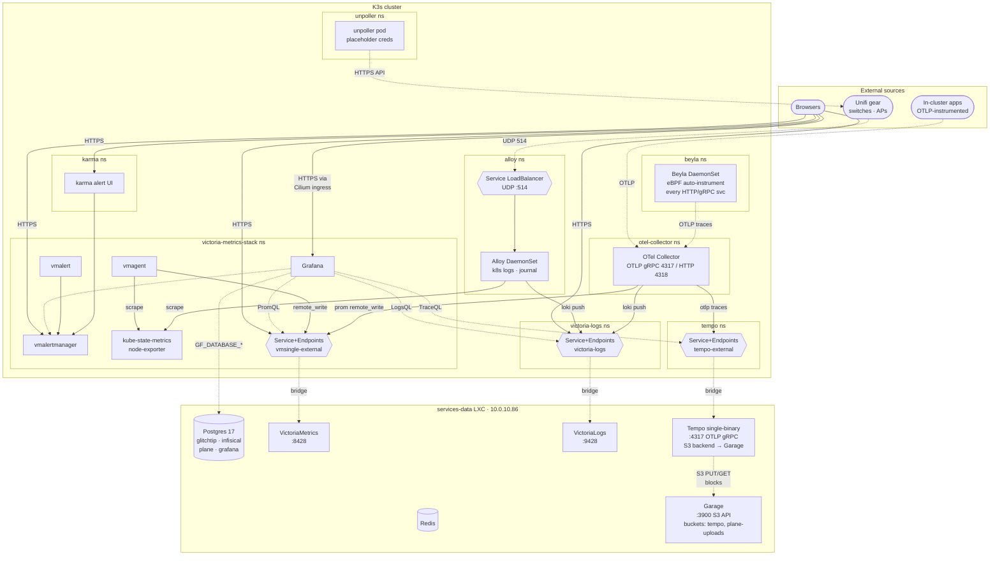

# Observability Stack Implementation Plan

Date: 2026-04-25

This plan captures the bare-bones observability stack to be deployed into the
K3s cluster through the existing GitOps flow. Written as an implementation
handoff so a fresh agent can resume mid-build without losing context.

> **Status:** This plan now supersedes
> `docs/plans/plane-enterprise-kubernetes.md` for live deployment sequencing.
> Plane migrations have completed, but the live deployment is still degraded:
> the API pod never becomes Ready and the chart-bundled MinIO path is still
> live. The authoritative recovery path is to finish the shared
> `services-data` and Garage work here, then complete a clean Garage-backed
> Plane redeploy before this plan is considered done.

## Goal

Deploy a complete-but-unconfigured observability stack so each component is
running, wired to its peers, and reachable via TLS — but no dashboards
imported, no app instrumented, no alert rules defined, no Unifi gear sending
data yet. Login screens render. Configuration becomes a learning exercise.

This plan's definition of done now also includes **closing out Plane's degraded
deployment** by moving it onto the same shared `services-data` backplane:
external Postgres on the LXC plus Garage-backed object storage for uploads.

The contract: **everything is connected at the backplane level; nothing is
opinionated above that.**

One deliberate exception to "no app instrumented": **Beyla (Grafana's
distribution of upstream OpenTelemetry eBPF Instrumentation, OBI)** runs as a
DaemonSet and auto-instruments every HTTP/gRPC service in the cluster at the
kernel level, with zero application code changes. This unlocks distributed
traces of unmodified third-party software (GlitchTip, Plane, Infisical,
DeepTutor) that you'd otherwise have to fork to instrument. Tempo
single-binary lives on the LXC to receive those traces.

## Architecture



## Decisions

### Storage / state location (Q1+Q2)

- VictoriaMetrics single-binary and VictoriaLogs single-binary run as **native
  binaries on the existing `services-data` LXC**, alongside Postgres and Redis.
- Reached from in-cluster pods via headless `Service` + `Endpoints` resources
  pointing at `10.0.10.86`, mirroring the Glitchtip → external Postgres
  pattern.
- Rationale: matches the recent consolidation direction (commits `9bc5d5c`
  and `be814ab` both name `services-data` as **the shared LXC**), simplifies
  backup story to one nightly job covering Postgres + VM + VL state, and LXC
  resource bumps are trivial when load grows.
- **Accepted tradeoff**: `services-data` is now also where Infisical's DB
  lives. If the LXC fails, both observability and Infisical secret rotation
  are affected — the textbook anti-pattern of co-locating monitoring with the
  thing you most want to monitor when it fails. Acceptable for a homelab in
  exchange for operational simplicity. Worth a one-line caveat comment in the
  `services_data` role defaults.

### Resource bump for `services-data` (Q1 follow-on)

`services-data` currently sized at `cores: 2 / memory_mb: 2048 / disk_size:
30G`. Required pre-deployment bump:

| Resource | Current | Target |
|---|---|---|
| cores | 2 | 4 |
| memory_mb | 2048 | 6144 |
| disk_size | 30G | 120G |

Estimated steady-state memory budget at this size:

| Workload | RAM |
|---|---|
| Postgres (glitchtip + infisical + plane + grafana) | ~400 MB |
| Redis | ~50 MB |
| vmsingle (5-node cluster scrape) | ~300-500 MB |
| vlsingle (k8s + syslog) | ~200-400 MB |
| Tempo single-binary (S3 backend) | ~200-300 MB |
| Garage (single-node, two consumers) | ~300-400 MB |
| OS overhead | ~250 MB |
| **Comfortable total** | **~6 GB** |

Disk covers Postgres growth, VM/VL block storage, and Garage's data dir
which holds both Tempo blocks (~10 GB) and Plane uploads (~3 GB initial,
configurable in `plane_minio_storage_size`).

### Namespace strategy (Q3)

- **Directory-per-namespace**: keep the existing cluster-apps ApplicationSet
  pattern where directory basename = namespace.
- Eight observability namespaces total: `victoria-metrics-stack`,
  `victoria-logs`, `alloy`, `otel-collector`, `unpoller`, `karma`,
  `tempo`, `beyla`.
- Cross-component references use FQDN service DNS
  (e.g. `http://victoria-logs.victoria-logs.svc.cluster.local:9428`) so future
  consolidation into a single `monitoring` namespace (if NetworkPolicy needs
  ever materialize) is a cheap manifest restructure — all genuinely-stateful
  data already lives on the LXC, so the in-cluster footprint is mostly
  stateless and cheap to move.

### OTel Collector + Tempo scope (Q4)

- **Decision: revised.** Deploy OTel Collector in Phase 7 and wire traces to
  Tempo in Phase 7.5 as part of the same observability rollout. OTLP
  receivers (gRPC 4317, HTTP 4318) are ready as soon as the cluster syncs;
  metrics route to vmsingle, logs route to vlsingle, and traces flow to
  `tempo-external` once the external bridge exists.
- Rationale: once Beyla is in scope, Tempo is no longer a cheap optional
  follow-up; it is the backplane that makes Beyla's traces useful. The plan
  should tell one tracing story end-to-end, not a debug-placeholder story in
  one section and a live Tempo story in another.

### Distributed tracing via Beyla + Tempo (post-Q5 addition)

- Added after the grill-me round wrapped, in response to "what's the single
  most innovative addition we could make."
- **Beyla DaemonSet** (Grafana's distribution of upstream OBI) auto-instruments
  every HTTP/gRPC service in the cluster at the kernel level via eBPF. Zero
  code changes to any application. Emits OTLP traces to the OTel Collector.
- **Tempo single-binary** lives on the `services-data` LXC alongside
  VictoriaMetrics and VictoriaLogs. Storage backend is **S3 → Garage**
  running on the same LXC (see Garage decision below). Reached from
  in-cluster pods via Service+Endpoints, same pattern as VM/VL.
- **OTel Collector's traces exporter** points at the Tempo Service+Endpoints,
  closing the loop so traces from both Beyla and any future SDK-instrumented
  apps land in Tempo.
- **Kernel requirement**: Beyla needs Linux 5.8+ with BTF enabled; 5.17+
  for full HTTP context propagation. Verify Rocky Linux node kernels meet
  this in Phase 0. Current cluster nodes are on Rocky 9.5 kernel
  `5.14.0-503.31.1.el9_5.x86_64`, so basic eBPF instrumentation is plausible,
  but Phase 11 should only require spans to arrive in Tempo/Grafana; full
  cross-service propagation on 5.14 should be treated as a best-case outcome,
  not the baseline guarantee.
- **Beta caveat**: upstream OBI is at v0.8.0 beta. Grafana's Beyla
  distribution (chart 1.16.5, app 3.9.5) is production-acceptable for
  homelab learning. Failure mode if eBPF probes misbehave: uninstall the
  DaemonSet, no impact on anything else.

### Garage as shared S3 backend (post-Q5 addition, replaces MinIO drop)

- MinIO upstream archived 2026-04-25 (pivoted to proprietary AIStor). Avoid
  introducing it as a new dependency.
- **Garage v2.3.0** (deuxfleurs, Rust, AGPLv3, released 2026-04-16) runs
  as a systemd service on the `services-data` LXC. S3-compatible API on
  port 3900. Single-node config (`replication_factor = 1`).
- **Two consumers**:
  - **Tempo** — bucket `tempo`, S3 backend with `forcepathstyle: true` and
    `region: garage`
  - **Plane** — bucket `plane-uploads`, replaces chart-bundled MinIO (see
    cross-plan note in `plane-enterprise-kubernetes.md`)
- **S3 compatibility gaps in Garage** (no versioning, no ACLs, no bucket
  policies, no SSE) don't affect either consumer. Validated by the Garage
  S3-compatibility matrix.
- **Container image**: `dxflrs/garage`. Helm chart exists but standalone
  install on the LXC matches the established pattern; no chart needed in
  cluster.
- **Cross-plan cooperation**: this is the first piece of infrastructure
  shared between the observability and Plane stacks. The Plane plan now
  references this section as the source of truth for Garage's deployment
  shape.

### Plane close-out ownership (post-migration addition)

- Plane's first rollout is not considered complete. It is currently stuck in a
  disposable bootstrap state waiting on DB migration, and no user data exists
  that justifies preserving that state.
- This observability plan now owns the live sequence that finishes Plane:
  Garage bootstrap, Plane DB reset, secret rewiring, redeploy, and final
  verification.
- `docs/plans/plane-enterprise-kubernetes.md` remains useful, but only as the
  reference for Plane-specific chart values, ingress routes, and secret
  contract details. It is no longer the authoritative execution order.
- This plan is not done until Plane is healthy at
  `https://plane.local.bysliek.com`, uploads land in Garage bucket
  `plane-uploads`, and Tempo/Grafana can see traces emitted from Plane via
  Beyla.

### Auth / exposure for non-Grafana UIs (Q5)

- **Decision: A.** Raw HTTPS on internal LAN, no auth in front of vmui,
  vlogs UI, vmalertmanager, or karma. TLS via cert-manager + the existing
  cloudflare-cluster-issuer; ingresses resolve via internal DNS at
  `*.local.bysliek.com`.
- Rationale: single-tenant homelab, private LAN, no internet exposure.
  Wrapping these UIs in oauth2-proxy or authentik now would make the first
  interaction with each tool a fight with auth config rather than learning
  the platform itself.
- Grafana keeps its built-in login (admin user, password sourced from
  Infisical, change on first login).
- SSO follow-up: when more services with UIs accumulate (and especially
  when any of them need to be reachable beyond the LAN), revisit with a
  dedicated authentik plan. That project would need Postgres (have it),
  Redis (have it), SMTP, OIDC outpost wiring per ingress.

### Open questions

None — plan is fully aligned. Ready for user approval to begin Phase 0.

## Verified facts (researched 2026-04-25)

| Component | Repo | Chart | Version | Image |
|---|---|---|---|---|
| VictoriaMetrics k8s-stack | `https://victoriametrics.github.io/helm-charts/` | `victoria-metrics-k8s-stack` | `0.74.1` (app `v1.140.0`) | `docker.io/victoriametrics/victoria-metrics` |
| VictoriaLogs single | same | `victoria-logs-single` | `0.12.2` (app `v1.50.0`) | `docker.io/victoriametrics/victoria-logs` |
| Grafana Alloy | `https://grafana.github.io/helm-charts` | `alloy` | `1.8.0` (app `v1.16.0`) | `docker.io/grafana/alloy` |
| OTel Collector | `https://open-telemetry.github.io/opentelemetry-helm-charts` | `opentelemetry-collector` | `0.152.0` (app `0.150.1`) | `docker.io/otel/opentelemetry-collector-contrib` |
| unpoller | `https://unpoller.github.io/helm-chart` | `unpoller` | `2.1.0` (app `v2.21.0`) | `ghcr.io/unpoller/unpoller` |
| karma | (no official chart) | hand-rolled | `v0.129` | `ghcr.io/prymitive/karma` |
| Tempo (single-binary) | `https://grafana-community.github.io/helm-charts` (post-migration; verify with `helm search repo tempo`) | `tempo` | `2.0.0` (app `2.10.1`) | `docker.io/grafana/tempo` |
| Beyla (Grafana's OBI distribution) | `https://grafana.github.io/helm-charts` | `beyla` | `1.16.5` (app `3.9.5`) | `docker.io/grafana/beyla` |
| Garage (LXC-installed, no in-cluster chart) | binary download from `https://garagehq.deuxfleurs.fr/download/` | n/a | `v2.3.0` (released 2026-04-16) | `docker.io/dxflrs/garage` (reference only — installed as binary) |

Other facts that informed decisions:

- VictoriaMetrics docs explicitly support NFS storage (Amazon EFS / Google
  Filestore are blessed). Historical issues (`#5012`, v1.82.0 release notes)
  center on unclean-shutdown corruption on generic NFS, not steady-state.
  Co-locating on LXC sidesteps the question entirely.
- VictoriaLogs accepts Loki-compatible push at
  `:9428/insert/loki/api/v1/push` — Alloy can ship to it via `loki.write`.
- Cilium ingress is HTTP/HTTPS only. UDP/514 syslog from Unifi gear must use
  a `Service` of `type: LoadBalancer` with `protocol: UDP` (gets an IP from
  the existing Cilium LB pool).
- unpoller's official chart bundles a Prometheus-Operator `PodMonitor`. This
  cluster runs the VictoriaMetrics operator which uses `VMPodScrape`. Disable
  the bundled PodMonitor and add a VMPodScrape instead.
- Grafana 13.x supports Postgres backend via `GF_DATABASE_TYPE=postgres` +
  `GF_DATABASE_HOST/NAME/USER/PASSWORD/SSL_MODE` env vars.
- Tempo single-binary supports `local`, `s3`, `gcs`, `azure` storage
  backends. Using `s3` pointing at Garage on `services-data` so Plane and
  observability share one S3 backend (no MinIO).
- Beyla's required env vars to ship to in-cluster collector:
  `OTEL_EXPORTER_OTLP_ENDPOINT=http://otel-collector.otel-collector.svc.cluster.local:4317`,
  `OTEL_EXPORTER_OTLP_PROTOCOL=grpc`. Beyla is upstream OBI's previous name;
  Grafana donated the project to OpenTelemetry in May 2025 but still
  publishes the Helm-distributable build under the Beyla name.
- MinIO archived its GitHub repo on 2026-04-25 and pivoted to AIStor
  (proprietary). Garage is the chosen S3 replacement — it's also being
  retrofitted into the Plane plan to remove Plane's chart-bundled MinIO.
- Garage S3 API operations supported: full Put/Get/Delete/Head/Copy
  Object, multipart upload, ListObjectsV2, sigv4 presigned URLs. Missing:
  versioning, ACLs, bucket policies, SSE — none of which Tempo or Plane
  use.
- Garage requires path-style addressing — Tempo S3 backend must set
  `forcepathstyle: true`. Plane's django-storages defaults are compatible.
- Plane chart `plane-enterprise` supports external S3 via
  `services.minio.local_setup: false` plus `env.aws_access_key`,
  `env.aws_secret_access_key`, `env.aws_region`, `env.aws_s3_endpoint_url`.
  Validated by community usage (Plane GH issue #1318, Wasabi external S3).

## Phased implementation

### Phase 0 — `services-data` resource bump + kernel verification

- Edit `config.yaml` `services-data` block: cores 4, memory_mb 6144,
  disk_size 120G.
- Re-run cluster-create / Proxmox container update flow to apply the resize.
  Disk grow is online; CPU/RAM bump needs a container reboot.
- **No coordination needed with Plane's in-flight bootstrap.** The
  current partial Plane deployment will be torn down and redeployed
  fresh against Garage as part of Phase 3.5 below.
  No data exists to preserve. Reboot `services-data` whenever Phase 0
  is ready.
- **Verify Rocky Linux node kernels meet Beyla requirement**: `ansible all
  -i ansible/inventory/hosts.yaml -m shell -a "uname -r"`. Need ≥5.8 for
  basic operation, ≥5.17 for full HTTP context propagation. Rocky 9.x
  ships 5.14+ with BTF backports — should be fine for first-pass validation,
  but keep the smoke test calibrated to "spans arrive" unless kernels move to
  5.17+ before Phase 8.5 deployment.

### Phase 1 — ArgoCD project plumbing (CRITICAL FIRST STEP per CLAUDE.md)

Update `templates/kubernetes/bootstrap/projects/monitoring.yaml.j2`:

- `sourceRepos` add:
  - `https://victoriametrics.github.io/helm-charts/`
  - `https://grafana.github.io/helm-charts` (covers Alloy, Beyla)
  - `https://grafana-community.github.io/helm-charts` (Tempo single-binary,
    post-migration; verify with `helm search repo tempo`)
  - `https://open-telemetry.github.io/opentelemetry-helm-charts`
  - `https://unpoller.github.io/helm-chart`
- `destinations` add namespaces:
  - `victoria-metrics-stack`, `victoria-logs`, `alloy`, `otel-collector`,
    `unpoller`, `karma`, `tempo`, `beyla`

### Phase 2 — Grafana backing Postgres + Plane DB alignment on `services-data`

Mirror the existing external-Postgres secret pattern used by GlitchTip and
Plane: app pods consume DB connection details from an Infisical-managed secret
that points directly at `services-data`. The `Service + Endpoints` bridge used
later for VictoriaMetrics / VictoriaLogs / Tempo is a new pattern in this repo,
not something GlitchTip already does today.

1. `config.yaml` additions:
   ```yaml
   grafana_postgres_db: "grafana"
   grafana_postgres_user: "grafana"
   grafana_postgres_port: 5432
   services_data_enable_grafana_db: true
   ```
2. Manual one-time step (you, not the agent): create Infisical secret at
   `/kubernetes/grafana` with `POSTGRES_PASSWORD`, `DB_HOST=10.0.10.86`,
   `DB_PORT=5432`, `POSTGRES_USER=grafana`, `POSTGRES_DB=grafana`,
   `GF_SECURITY_ADMIN_PASSWORD` (initial admin password to change on first
   login).
3. Update `ansible/playbooks/services-data.yml` to fetch
   `_grafana_infisical` and append a `{name: grafana, ...}` entry to
   `services_data_postgres_databases`.
4. Run `task ansible:configure-services-data` to provision DB + role.
5. In the same pass, confirm Plane's existing external-Postgres wiring still
   matches reality:
   - `config.yaml` retains `plane_postgres_db`, `plane_postgres_user`,
     `plane_postgres_host`, `plane_postgres_port`, and
     `services_data_enable_plane_db: true`
   - `/kubernetes/plane` retains `POSTGRES_PASSWORD`, `DB_HOST`, `DB_PORT`,
     `POSTGRES_USER`, `POSTGRES_DB`
   - the current Plane schema is **not** treated as authoritative; Phase 3.5
     will drop and recreate it before the final redeploy

### Phase 3A — Extend `services_data` role with VictoriaMetrics + VictoriaLogs + Tempo + Garage

- Add `services_data_observability_enabled: true` flag to role defaults
  (mirrors existing `services_data_enable_*_db` pattern).
- Implementation notes for the host-side services:
  - VictoriaMetrics / VictoriaLogs come from the official package repo.
  - Tempo / Garage come from pinned release artifacts with checksum
    verification at install time.
  - Each service gets a dedicated system user, config under `/etc/<service>`,
    data under `/var/lib/<service>`, and a systemd unit named after the
    service with `Restart=on-failure`.
- Host/bootstrap tasks (gated on the flag):
  - Add VictoriaMetrics apt repo, install `victoria-metrics` and
     `victoria-logs` deb packages.
  - Drop systemd units listening on `0.0.0.0:8428` (vmsingle) and
     `0.0.0.0:9428` (vlsingle) with data dirs under
     `/var/lib/victoria-metrics` and `/var/lib/victoria-logs`.
  - **Install Garage v2.3.0** from official static binary
     (`https://garagehq.deuxfleurs.fr/_releases.html`), drop systemd unit
     listening on `0.0.0.0:3900` (S3 API) and `127.0.0.1:3901` (RPC,
     single-node), config at `/etc/garage.toml` with
     `replication_factor = 1`, data dir `/var/lib/garage/data`, metadata
     dir `/var/lib/garage/meta`. Bootstrap with `garage server
     --single-node --default-access-key`.
  - Install Tempo binary from Grafana releases tarball (no apt repo); drop
      systemd unit listening on `0.0.0.0:4317` (OTLP gRPC) and `0.0.0.0:4318`
      (OTLP HTTP), with **`s3` backend pointing at Garage at
      `127.0.0.1:3900`** (loopback, no network round-trip), bucket `tempo`,
    `forcepathstyle: true`, `region: garage`, `insecure: true`. WAL at
    `/var/lib/tempo/wal`. Minimal config: single-tenant, 30-day retention.
  - If a host firewall is already enabled on `services-data`, add allow rules
     for `node_network` to VM/VL/Tempo and Garage S3 ports. If no host firewall
     is enabled, do not introduce a one-off firewall implementation in this
     plan; track host-firewall hardening as a separate infrastructure follow-up.
  - One-line caveat comment in defaults documenting the
     observability/Infisical/Plane co-location risk.
- Run `task ansible:configure-services-data`.

### Phase 3B — Publish Garage credentials + prepare Plane secret contract

- Create two buckets via `garage bucket create`: `tempo` and
  `plane-uploads`. Create two access keys (one per consumer) via
  `garage key create`, grant per-bucket read/write permissions.
- Stash the resulting access/secret keys in Infisical at
  `/services-data/garage/{tempo,plane}` for in-cluster pods to consume.
- Treat `/services-data/garage/plane` as the canonical source of truth for
  Plane's S3 credentials; do not copy those values into `/kubernetes/plane`.
- The eventual Plane doc-store `InfisicalSecret` should read directly from
  `/services-data/garage/plane`, while the rest of Plane continues to read from
  `/kubernetes/plane`.
- Extend the relevant machine-identity grants so the Plane deployment can read
  `/services-data/garage/plane`.

### Phase 3.5 — Plane repo migration + clean redeploy

This phase absorbs the remaining *live execution* work from
`docs/plans/plane-enterprise-kubernetes.md`. Use that document only as the
reference for Plane-specific manifests and value shapes; this section is the
authoritative rollout order. Current live state: migrations complete, bundled
MinIO still exists, and the API pod is degraded / not Ready.

1. Update the repo-side Plane assets to the Garage end state:
   - `templates/kubernetes/apps/plane/values.yaml.j2`:
     `services.minio.local_setup: false`, external Garage bucket/endpoint
     values, and `use_storage_proxy: true`
   - `templates/kubernetes/apps/plane/templates/secrets/plane.infisicalsecret.yaml.j2`:
     split the doc-store secret into its own `InfisicalSecret` that reads
     directly from `/services-data/garage/plane`, emits Garage-style keys
     (`AWS_ACCESS_KEY_ID`, `AWS_SECRET_ACCESS_KEY`, `AWS_REGION`,
     `AWS_S3_ENDPOINT_URL`), and removes `USE_MINIO`, `MINIO_ROOT_USER`, and
     `MINIO_ROOT_PASSWORD`
   - `templates/kubernetes/apps/plane/templates/plane-ingress.yaml.j2`:
     stop routing `/uploads` to `plane-app-minio`; either proxy uploads through
     the API/storage-proxy path or remove the MinIO-specific route entirely
   - confirm the surrounding repo plumbing still holds:
      `templates/kubernetes/bootstrap/projects/apps.yaml.j2` includes namespace
      `plane`, `templates/ansible/playbooks/services-data.yml.j2` and related
      vars still support `services_data_enable_plane_db: true`, and
      `scripts/create-machine-identities.sh` grants both `/kubernetes/plane/**`
      and `/services-data/garage/plane`
2. Re-render and publish the Garage-backed repo shape before any live prune:
   - `task configure`
   - `helm dependency build kubernetes/apps/plane`
   - commit/push the repo-side Plane template migration from step 1
   - confirm ArgoCD now sees the Garage-backed desired state in git
3. Update Plane's live secret contract in Infisical:
   - keep `SECRET_KEY`, `LIVE_SERVER_SECRET_KEY`, `AES_SECRET_KEY`,
      `SILO_HMAC_SECRET_KEY`, `POSTGRES_PASSWORD`
   - keep Plane's doc-store credentials canonical at
      `/services-data/garage/plane`; the split doc-store `InfisicalSecret`
      reads them directly from there
   - remove `MINIO_ROOT_USER`, `MINIO_ROOT_PASSWORD`, and `USE_MINIO`
4. Tear down the partial Plane bootstrap and reset its database:
   - preferred: delete the ArgoCD `plane` Application with cascade pruning
   - fallback: delete namespace `plane` and wait for PVC/finalizer cleanup
   - on `services-data`, drop and recreate database `plane` owned by role
      `plane`
   - rationale: the current state is disposable bootstrap, not data worth
      preserving
5. Let ArgoCD recreate Plane from the Garage-backed source of truth:
   - let ArgoCD resync `kubernetes/apps/plane`
   - verify the recreated app no longer renders bundled MinIO resources
6. Close-out checks:
   - `kubectl -n plane get pods,svc,ingress,jobs`
   - `kubectl -n argocd get application plane`
   - `curl -skI https://plane.local.bysliek.com/`
   - Plane login/bootstrap page renders, API pods become Ready, no bundled
     MinIO workload or bucket-init job exists, and a test upload lands in
     Garage bucket `plane-uploads`

### Phase 4 — VictoriaMetrics k8s-stack

`templates/kubernetes/monitoring/victoria-metrics-stack/`:

- `Chart.yaml.j2` — wrapper depending on `victoria-metrics-k8s-stack` 0.74.1
- `values.yaml.j2`:
  - `vmsingle.enabled: false` (using external on LXC)
  - `vmagent.remoteWrite.url: http://vmsingle-external:8428/api/v1/write`
  - `grafana.enabled: true`, override `grafana.grafana.ini.database.*` →
    external Postgres via env vars from `grafana-secrets` InfisicalSecret
  - Auto-provisioned datasources: VictoriaMetrics (self-via-Service),
    VictoriaLogs (cross-namespace FQDN), Alertmanager
  - **No pre-imported dashboards**
  - `alertmanager.enabled: true` (in-cluster, NFS PVC, ~10 MB state)
  - `vmalert.enabled: true`, no rules loaded
  - `kube-state-metrics`, `node-exporter`, `prometheus-operator-crds` enabled
- `templates/`:
  - InfisicalSecret `grafana-secrets` from `/kubernetes/grafana`
  - `Service` + `Endpoints` named `vmsingle-external` pointing at
    `10.0.10.86:8428`
  - Ingresses for `grafana.local.bysliek.com`, `vmui.local.bysliek.com`,
    `alertmanager.local.bysliek.com` (TLS via existing
    cloudflare-cluster-issuer)

### Phase 5 — VictoriaLogs

`templates/kubernetes/monitoring/victoria-logs/`:

- Hand-rolled external bridge only. Do **not** depend on
  `victoria-logs-single` in external mode; at the pinned chart version,
  rendering with `server.enabled=false` produces no manifests.
- `templates/`:
  - `Service` + `Endpoints` named `victoria-logs` pointing at
    `10.0.10.86:9428`
  - Ingress `vlogs.local.bysliek.com` with TLS

### Phase 6 — Grafana Alloy

`templates/kubernetes/monitoring/alloy/`:

- Wrapper on `alloy` 1.8.0, `controller.type: daemonset`
- River config in ConfigMap:
  - `discovery.kubernetes` → pod logs → `loki.write` to VictoriaLogs FQDN
  - `loki.source.journal` for systemd journal
  - `loki.source.syslog` listening UDP/514, label `source=syslog`
  - Cluster scraping: kubelet, cadvisor, kube-state-metrics, node-exporter
    targets → vmagent remote-write to vmsingle-external
- Separate `Service` of `type: LoadBalancer` exposing UDP/514 (gets a Cilium
  LB IP — point Unifi gear at this later)

### Phase 7 — OTel Collector gateway

`templates/kubernetes/monitoring/otel-collector/`:

- Wrapper on `opentelemetry-collector` 0.152.0, `mode: deployment`,
  image `otel/opentelemetry-collector-contrib`
- Receivers: `otlp` (gRPC 4317, HTTP 4318)
- Exporters:
  - `prometheusremotewrite` → vmsingle-external
  - `loki` → VictoriaLogs FQDN
  - `otlp` traces → `tempo-external.tempo.svc.cluster.local:4317`
- ClusterIP Service only (no ingress yet — apps and Beyla speak OTLP from
  inside the cluster)

### Phase 7.5 — Tempo bridge

`templates/kubernetes/monitoring/tempo/`:

- Hand-rolled external bridge only. Do **not** assume the
  `grafana-community/tempo` 2.0.0 chart has a safe "disable the embedded
  deployment, keep the useful bits" mode; validate any future chart-based
  approach from a render first. The baseline plan should treat this directory
  like a standalone bridge, not an upstream wrapper.
- `templates/`:
  - `Service` + `Endpoints` named `tempo-external` pointing at
     `10.0.10.86:4317` (OTLP gRPC) and `:3200` (Tempo query API)
  - Ingress `tempo.local.bysliek.com` for the query API with TLS

### Phase 8.5 — Beyla DaemonSet

`templates/kubernetes/monitoring/beyla/`:

- Wrapper on `beyla` 1.16.5, controller type DaemonSet (chart default)
- Required env vars:
  - `OTEL_EXPORTER_OTLP_ENDPOINT=http://otel-collector.otel-collector.svc.cluster.local:4317`
  - `OTEL_EXPORTER_OTLP_PROTOCOL=grpc`
- Discovery: instrument every namespace by default; revisit if noise
  becomes a problem (you can scope via `BEYLA_KUBE_NAMESPACE` later)
- Privileged container required (eBPF needs `CAP_SYS_ADMIN` /
  `CAP_BPF` / `CAP_PERFMON` and host PID namespace) — chart handles this
- No state, no PVC

### Phase 8 — unpoller

`templates/kubernetes/monitoring/unpoller/`:

- Wrapper on `unpoller` 2.1.0
- Disable bundled `PodMonitor` in values
- Hand-write a `VMPodScrape` template targeting the unpoller pod
- InfisicalSecret `unpoller-secrets` pointing at `/kubernetes/unpoller`,
  keys: `UP_UNIFI_DEFAULT_USER`, `UP_UNIFI_DEFAULT_PASS`,
  `UP_UNIFI_DEFAULT_URL`
- **Manual step**: you create `/kubernetes/unpoller` in Infisical with
  placeholder values. Pod will run and log auth failures until you populate
  real Unifi read-only user credentials. That's the "log in and configure"
  step for unpoller.

### Phase 9 — karma (hand-rolled)

`templates/kubernetes/monitoring/karma/`:

- `Chart.yaml.j2` standalone (no upstream dep)
- `templates/`:
  - Deployment with `ghcr.io/prymitive/karma:v0.129`, env
    `ALERTMANAGER_URI=http://vmalertmanager-stack.victoria-metrics-stack.svc.cluster.local:9093`
  - ClusterIP Service
  - Ingress `karma.local.bysliek.com` with TLS

### Phase 10 — Render, commit, deploy

```bash
task configure
git diff   # review generated YAML
git add -A
git commit -m "feat(monitoring): bare-bones observability stack"
git push   # ArgoCD picks it up
```

If Phase 3.5 required Plane-side template corrections, include them in the
same rollout or a directly adjacent follow-up commit so the repo and live
cluster converge together.

### Phase 11 — Smoke test

The "fall into login screens" check:

- `https://grafana.local.bysliek.com` → login screen, admin / Infisical-managed password
- `https://vmui.local.bysliek.com` → vmselect query UI
- `https://vlogs.local.bysliek.com` → VictoriaLogs UI
- `https://alertmanager.local.bysliek.com` → empty alert list
- `https://karma.local.bysliek.com` → empty dashboard, "no alerts firing"
- `https://tempo.local.bysliek.com` → Tempo query API responds (no UI; this
  is the API endpoint Grafana queries)
- `https://plane.local.bysliek.com` → Plane login/bootstrap page renders over
  the clean Garage-backed deployment
- `kubectl -n <each ns> get pods` → all `Running` except possibly `unpoller`
  in `CrashLoopBackoff` (auth error, expected — placeholder creds)
- `kubectl -n beyla get pods` → DaemonSet pod per node, all Running
- `kubectl -n plane get pods` → Plane API/web/live/silo workloads Running, no
  `plane-app-minio` StatefulSet or bucket-init job present
- Inside Grafana, **Datasources** page already populated with VM, VL,
  Tempo, Alertmanager — connection test passes for all four
- Inside Grafana, **Explore** → VictoriaLogs → query `{}` → see streaming
  logs from kube-system pods
- Inside Grafana, **Explore** → VictoriaMetrics → query `up` → see all
  scrape targets healthy
- Inside Grafana, **Explore** → Tempo → verify spans are arriving for at least
  one Beyla-observed service. On the current Rocky 9.5 / 5.14 kernels, treat
  "spans show up" as the required success condition; richer cross-service
  propagation is a stretch goal until kernels move to 5.17+.
- Inside Grafana, **Explore** → Tempo → search for `plane` / `plane-app-api`
  and confirm Plane traces now appear too — this proves both the Plane
  redeploy and the observability path are closed out together

## Out of scope (deliberately deferred — your learning surface)

- Importing Grafana dashboards (none — you'll learn by importing or building)
- App instrumentation (OTel SDK in deeptutor, etc.)
- Configuring Unifi gear to send syslog/SNMP to the LB IP from Phase 6
- Real Unifi credentials in unpoller secret
- Defining alert rules in vmalert
- Configuring Alertmanager receivers (Discord / ntfy / email)
- (None — Garage handles the S3 layer for both Tempo and Plane)
- Hubble metrics integration into vmagent (small follow-up)
- oauth2-proxy / authentik in front of vmui / karma / vlogs UIs — deferred
  by design (Q5: A). Logical follow-up project once more services accumulate
  UIs that need protection or reach beyond the LAN.
- Backup automation for VM/VL data on the LXC (separate backups project)

## Resume notes for a fresh agent

If picking this up cold:

1. Read this file end-to-end.
2. Read `docs/plans/plane-enterprise-kubernetes.md` only as a reference for
   Plane-specific Helm/Ingress/secret details; do **not** use it as the
   execution order.
3. Check `git log --oneline -10` for any progress already committed.
4. The Open Questions section is intentionally empty; if it changes later,
   resolve those before implementation proceeds.
5. The grill-me skill was used to align decisions; all five questions
   (Q1-Q5) are resolved and captured above. Plan is fully aligned.
6. Do not begin implementation until the user explicitly approves the plan.
